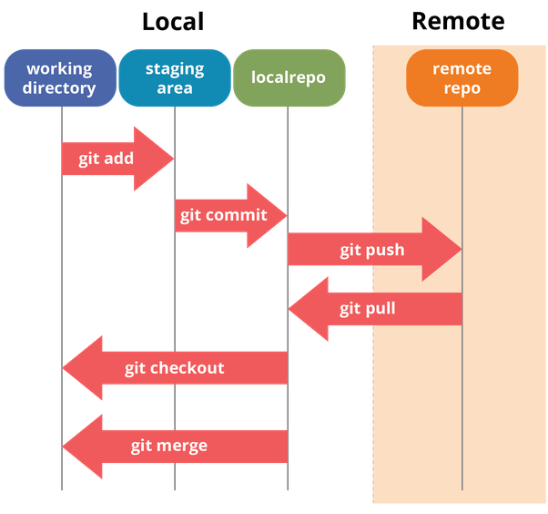
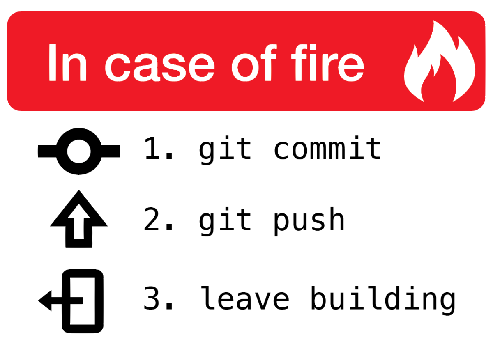

# Intro to Git

## What is git and why should care?
- Git is a Version Control System (VCS)
- It allows tracking of the history of files and changes made to them
- It is distributed and allows for different developers to work on a single project at once
- Makes tracing back software breaking changes easier

## Git vs GitHub
As git is the program that allows for version control and tracking, GitHub is a hosting (storage) service for git based repositories.

## Terminology
- `repository` | `repo` : storage location for a software package ("a folder with git monitoring")
- `untracked` : a file or directory not monitored by git, does not belong to the repo
- `tracked` : a file git was instructed to monitor (through the `add` command.)
- `commit` : a point on the temporal line of a repository. A "snapshot" of all the changes we "made official", or the last state of staged files before we commited.
Every commit has a unique id and must have a commit message. The more descriptive the message, the better.
- `local repo` : A repository of code on the computer you are currently using
- `remote` : A repository on a different machine (e.g.: Github)
- `forking a repo` : creating an alternative timeline for a repo, usually someones repo we want to have a copy of our own.
- `cloning a repo` : making a local copy of a remote repo
- `push` : sending the changes from local repo to a remote.
- `pull` : bringing changes of a remote repo to a local one
- `.gitignore` : text file with files/folders we do not want git to track or ask about.
    - e.g.:
        
        logo.jpg `# git ignores file with specific name`  

        develop_test/ `# git ignores directory with specific name and all it's content. Mind the / after the name.` 

        *.jpg `# git ignores all files with given extension` 

Next...

- `branch` : ? 
- `merge` : ?
- `pull request` : ? 

## Commands

`git init`
- Turns a folder into an empty repository

`git add <file>`
- Adds a file to a repo stanging area

`git restore --staged <file>`
- Removes a file from staging area

`git commit -m "<message>"`
- Writes all changes on staging area to repo

- `-a`
    - Commits all changes to files belonging to repo (all files that were previously added)
- `-m`
    - Allows for the message to be typed into the command instead of opening vim.
- `-am` == `-a -m`

`git log`
- Shows all commits on a repo

`git reset --hard <commit_id>`
- HARD resets branch to commit specified. "Goes back in time"

`git remote add <name> <url>`
- Connects the current local repo to a remote on `url` calling it `name`.

`git clone <url>`
- Makes local copy of remote repository

`git pull <remote> <branch>`
- e.g.: `git pull origin master`
- Brings changes from `remote` `branch` into current one.

`git push <remote> <branch>`
- e.g.: `git push origin master`
- Sends changes from local repo to `remote` `branch`

Next...

`git branch`
- Lists all branchs on current repo

`git branch <name>`
- Creates a branch of given name

`git checkout`
- ?

`git checkout -b`
- ?

`git merge <branch>`
- ?

## Tips
- Explicity declare all files/directories/remotes/branches while learning git
- More commits, each of specific changes, are better for tracing than all changes on a single commit
- Always write descriptive messages on the commits

# Workflow examples:

- Working on my own repo which I started locally:
    - `git init` to start repo
    - `git add <files>` to track files
    - `git commit -m "<message>"` to commit the changes
    - `git remote add <name> <url>` to connect repo to a remote one (create an empty repo on github to avoid conflicts)

- Working on a remote I have privileges to:
    - `git clone <url>` to make a local copy
    - `git add <files>` and `git commit -m "<message>"` to commit changes.
    - `git pull` BEFORE pushing. We want to bring foreign changes before sending our own to avoid conflicts.
    - `git push` to send our changes. 
    - Also good to `git pull` before begining the work each session to be sure we have the last version of the software.

- Working on a remote I don't have privileges to:
    - `fork` on github to create an alternate of our own
    - `git clone` to copy our fork to local
    - `git commit`, `git add`, `git push` to have our changes reflected on our remote copy
    - `pull request` to see if owner accepts our changes

## Git areas

# Remember

