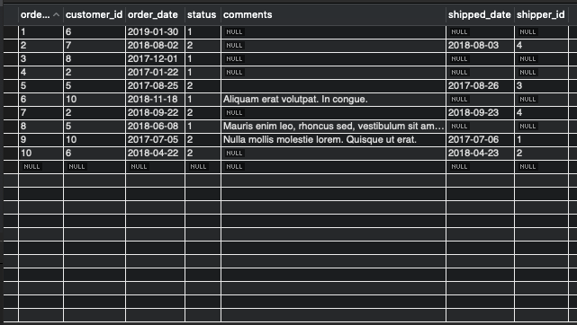

# SQL

## What is a database?

- A collection of data in a format that allows easy accessibility.
    - Retrieve
    - Insert
    - Delete
    - Change

## Database Managment System (DBMS)
- Database Engine (MySQL)
    - Software that allows us to communicate with it through instructions in order to fetch, insert, delete and uptade data.

## Types of Databases
- Relational database engines
    - MySQL
    - Oracle
    - PostgreSQL
    - MariaDB
    - SQLite
    - etc..

- Non-Relational (noSQL) database engines
    - mongoDB
    - Couchbase
    - ObjectDB
    - etc...

## Relational Databases

### Table
- Is composed of Rows and Columns
- Rows represent entities, instances of a type of object.
- Columns represent attributes of the instances
- Records (rows) in a table have an unique identifier, called **Primary Key**.
- A record on a table may relate with data of a different table, through the primary key of the second table. This is know as **Foreign Key**.



_Data stored in table format is known as tabular data_

## SQL
- A `declarative` programming language
- Structured Query Language
- SEQUEL


_In SQL, all that matters is `WHAT` we want, not `HOW` it's done._

    - Shakespeare, William

### The different Tools

```
MySQL -> DBMS
SQL -> Programming Language
MySQL Workbench -> GUI (Graphical User Interface)
Python(SQL Alchemy) -> Interface
```
----
## Querying

The command sent using SQL to interact with a database (Fetch, Create, Update, Delete) is called a `QUERY`. It is also known as an `Statement`. 
In SQL, every statement ends with a semi-colon(`;`)

The different parts od a Statement are known as `clauses`, e.g.: `the WHERE clause, the SELECT clause, etc.`

The different queries we use in SQL will begin with a different keyword depending on the action we want to achieve.

`NOTE: The <   > indicate you must change it for a value and should not be a part of the query`

### `USE <database>;`
This is how we can tell SQL which database we will be using. This allows us to omit the name of the database, which we would have to write everytime otherwise.

### `INSERT INTO <table> (<columns>) VALUES (<values>);`
This is how we create new rows on a given table. Some columns may have default values, such as an incremental Primary Key and can be left out.

### `UPDATE <table> SET <column> = <value> WHERE <condition>;`
How to change a value on a column or columns of a given table. Remember that the `WHERE` clause is very important. On it's absence, the same value will be set for all the rows.

### `DELETE FROM <table> WHERE <condition>`
It's self explanatory, but here more than ever the `WHERE`is all mighty important. _No WHERE means no database._

### `SELECT <columns> FROM <table> ...;`
This is the most used type of query. It is selecting that we can access the data on a given database, relate different databases, different tables and do calcultions and processes on the data.

Here is where the fun begins.

Quick cheat-sheet:
- `WHERE`
    
    This is how we filter using conditions.

- `ORDER BY`
    
    Sorting based on one or more columns. The keyword `DESC` can be used to invert the order.

- `LIMIT`

    If used with a single value, will limit the number of rows returned by the select statement.
    
    It can have 2 parameters, in which case, the first is the offset and the second is the limit.

- `SELECT DISTINCT`

    Selects a unique set from given column.

- `AS`

    Sets an alias for a column or table.

- `JOIN ... ON`

    The bread and buttert of relational databases. This is how different tables can be combined into a single one by use of a common valued column.

    - `INNER JOIN`
    - `LEFT JOIN`
    - `RIGHT JOIN`
    - `FULL OUTER JOIN`

- `GROUP BY`

    This is how we create a single row from multiple rows with a common value. Don't forget that the values on the SELECT clause must either be on the GROUP BY clause or on aggregated.

-----

## Designing Databases

Designing databases is an art form of it's own, and it is not our main focus, but it's never a bad idea to know a few concepts.

We can divide it into two main points:

### Tables
- Each table must contain data on a specific type of "object", e.g.: user, customer, sale, car, product, invoice, publisher, etc.
- The columns represent the fields ("characteristics") we want to record. `REMEMBER: `This information should be information related to that object and "non-calculable". Store `date_of_birth` instead of `age`. Age changes and we don't want to have to update our database all the time. Also don't record things such as `number_of_purchases`, unless necessary. This is information that derives from other columns and tables. ;)
- Give descriptive names
- Remember Primary Keys
- Set columns attributes PK, NN, AI, Default
    - Primary Key
    - Not Null
    - Auto Increment
    - Default value

### Relations
There are different kinds of relations, but first, let's remember a few concepts.

- Primary key

Is the unique identifying column on a table.

- Foreign key

Primary key "borrowed" on the second table to relate them.

- Parent table

The "og" original owner of the primary key.

- Child table

The table that borrows a key from parent

- Identifying relation

Foreign key is part of child table primary keys

- Non identifying relation

Foreign key is not part of child tabler primary key

## Types of relations 
- 1:1
    - These relations are like splitting a table into two. It allows us to have less columns on a particular table. Also useful in cases where we expect columns to have lots of nulls, this way we can only have records for these columns for not null data on a different table.
- 1:n
    - Allows us to have one record of parent table on multiple records of child table. 
- m:n
    - Creates intermediate table, child of both tables we want to connect.
    - Relations are 1:n between parent and child.
    - Usually identifying relationship

```
Each table may have multiple parents and multiple children.
```

----
## In class resources

You will find the diagram for the DB we designed in class on `data/web_store.mwb`

You will also find the script for creating such database on `data/create_gatete.sql` and filling it with data on `data/seed_gatete.sql`.

----
## Further Materials

- [No te olvides de poner el Where...](https://www.youtube.com/watch?v=i_cVJgIz_Cs&t=2s&ab_channel=JorgeRubiraSantos)
- [Sally Sequel](https://www.youtube.com/watch?v=27axs9dO7AE), the lego SQL DBMS. ;)